<picture>
  <source media="(prefers-color-scheme: dark)" srcset="assets/banner-dark.svg">
  
</picture>

<p align="center">
  <code>connect</code>&nbsp;
  <a href="https://linkedin.com/in/vishesh-gupta"></a>
  <a href="https://github.com/vishesh-monoceros"></a>
  <a href="mailto:vishesh.gupta12@outlook.com"></a>
</p>

<picture>
  <source media="(prefers-color-scheme: dark)" srcset="assets/status-dark.svg">
  
</picture>

<p align="center">
  <code>cloud</code>&nbsp;
  
  
</p>
<p align="center">
  <code>platform</code>&nbsp;
  
  
  
  
</p>
<p align="center">
  <code>code</code>&nbsp;
  
  
  
</p>
<p align="center">
  <code>ops</code>&nbsp;
  
  
  
</p>

<picture>
  <source media="(prefers-color-scheme: dark)" srcset="assets/offcall-dark.svg">
  
</picture>

<details>
<summary><code>$ cat vishesh.py</code></summary>

```python
class Vishesh:
    def __init__(self):
        self.role = "Staff Software Engineer at Alpaca"
        self.interests = ["Cloud Architecture", "DevOps", "SRE"]
        self.adventures = {
            "countries": "10 ✈️",
            "anime_episodes": "9000+ 📺",
            "fine_dining": "World #43 🥘",
            "passion": "Fashion & Style 🕴️",
        }
```

</details>

<p align="center">
  <picture>
    <source media="(prefers-color-scheme: dark)" srcset="https://streak-stats.demolab.com?user=Vishesh-Gupta&hide_border=true&background=00000000&ring=2C96C7&fire=3FB950&currStreakLabel=2C96C7&sideLabels=8B949E&dates=8B949E&currStreakNum=E6EDF3&sideNums=E6EDF3&stroke=30363D">
    
  </picture>
</p>

<p align="center"><sub>thanks for stopping by · <code>exit 0</code></sub></p>
